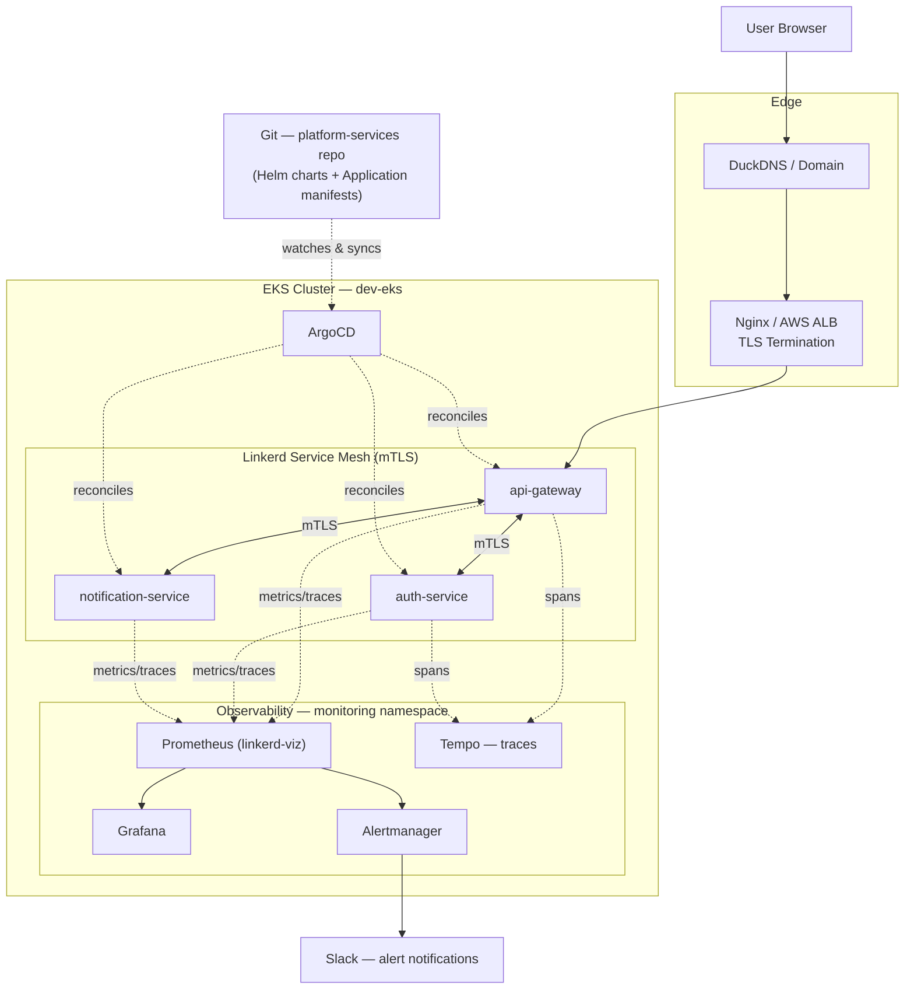

# Architecture

**Legend:** solid arrows = live request traffic. Dashed arrows = the GitOps reconciliation loop (ArgoCD watching Git and applying changes) and the telemetry loop (services emitting metrics/traces to the observability stack) — neither is triggered by a user request.
