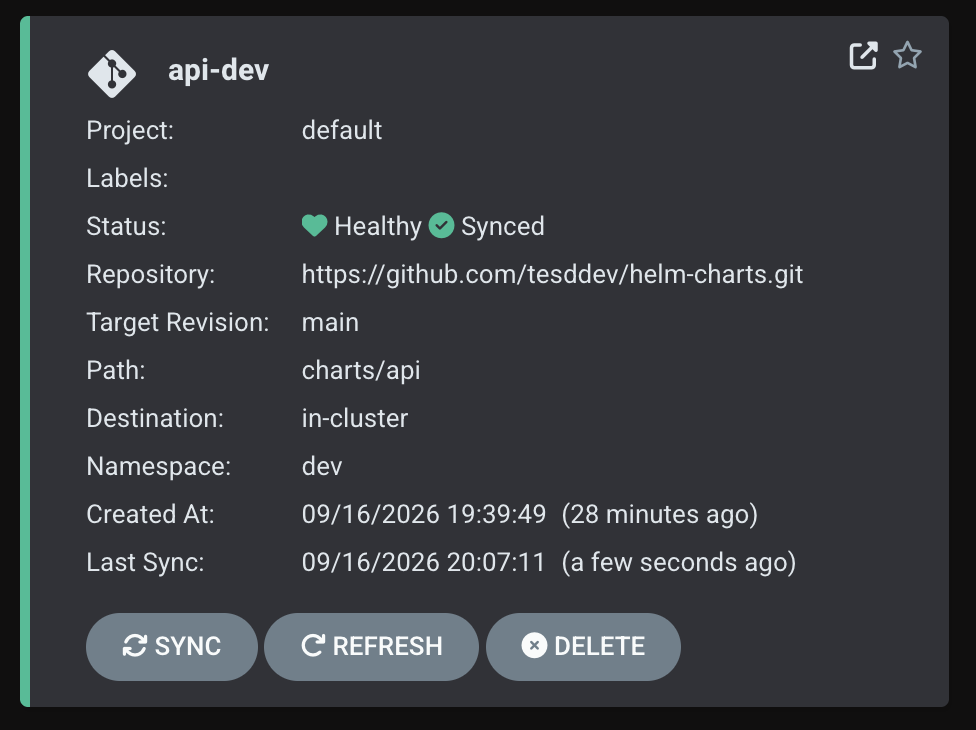
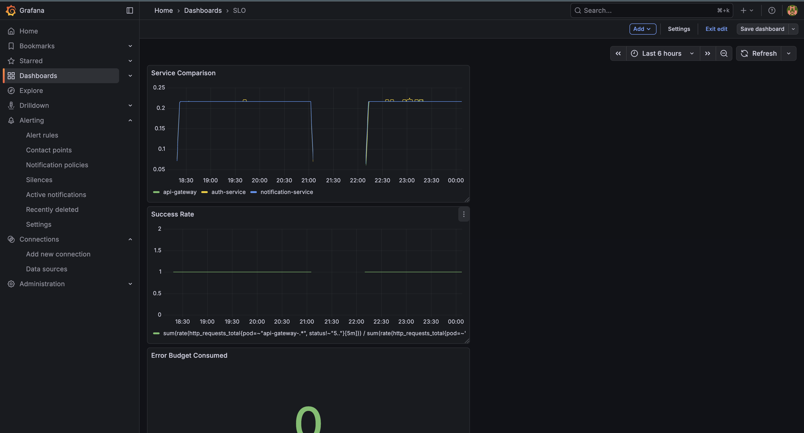
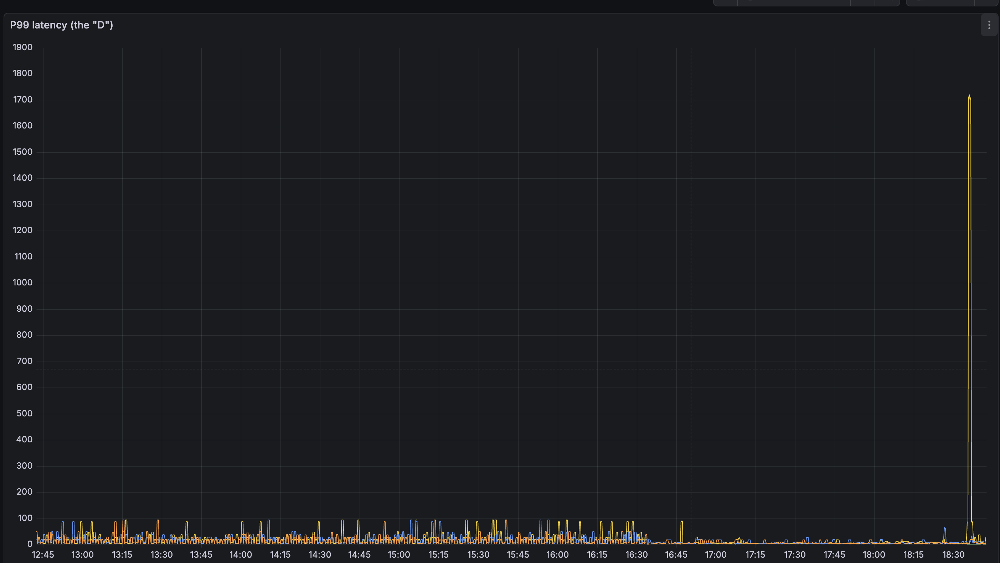
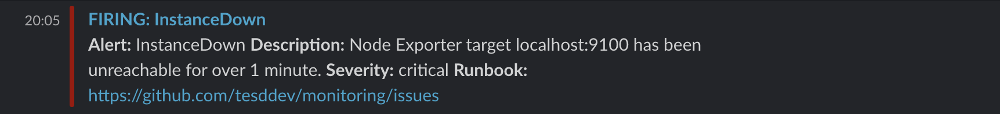
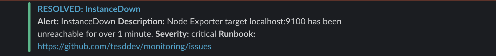

# Platform Tour

No recorded walkthrough for this build — what follows covers the same ground a video would have: how a change goes from a git commit to running in the cluster, what the platform looks like while healthy, and what happens when something breaks on purpose.

## 1. A commit becomes a running change

The cluster never gets `kubectl apply`'d to directly. Every service's desired state — image tag, replica count, resource limits — lives in Helm values files in Git. ArgoCD polls the repo and reconciles the cluster to match what it finds there.

Each of the three services (`api-gateway`, `auth-service`, `notification-service`) has its own ArgoCD `Application`. All three sit in `Synced` + `Healthy` state here — meaning the running cluster matches the last commit to the repo, and every pod is passing its readiness checks. If I edit a values file and push, ArgoCD picks it up within its polling interval and reconciles without anyone running a `kubectl` command. If someone deletes a pod manually, ArgoCD notices the drift and recreates it — the source of truth is the repo, not whatever's live at a given moment.

## 2. What healthy looks like

This dashboard tracks the three numbers that actually matter for a service: request rate, error rate, and latency (the "golden signals"), for all three services side by side. It's backed by Linkerd's own metrics — since every service is mesh-injected, request-level metrics come from the proxy sidecar rather than from instrumenting each service by hand. Same dashboard is what the on-call runbooks in `/runbooks` tell you to open first when an alert fires.

## 3. Breaking it on purpose — network delay experiment

The hypothesis: injecting 200ms of latency into `auth-service` calls should push p99 latency at the gateway above 500ms, since `api-gateway` calls `auth-service` synchronously on the request path.

The delay was injected via a Linkerd-compatible `NetworkChaos` resource for a fixed window. The graph shows p99 latency climbing during that window and dropping back to baseline within seconds of the chaos resource being deleted — no manual intervention, no pod restarts. That recovery speed is the actual point of the experiment: it's not just "does latency go up," it's "does the system recover cleanly once the fault is removed, with nothing left in a bad state."

## 4. An alert, start to finish

Simulated a real failure (scaled a service to zero) to trigger the "service unavailable" runbook end to end.

Alert fired to Slack with the service name, current value, and a link back to the relevant runbook — everything needed to start diagnosis without switching tools. Followed the runbook's diagnosis steps, restored the service.

One thing this drill actually surfaced, rather than confirmed: there was roughly a 4-minute gap between Grafana's internal alert state clearing and the RESOLVED message landing in Slack. That's now a logged action item rather than something papered over — the point of running the drill for real, instead of just describing the setup, is that it catches things like this.
